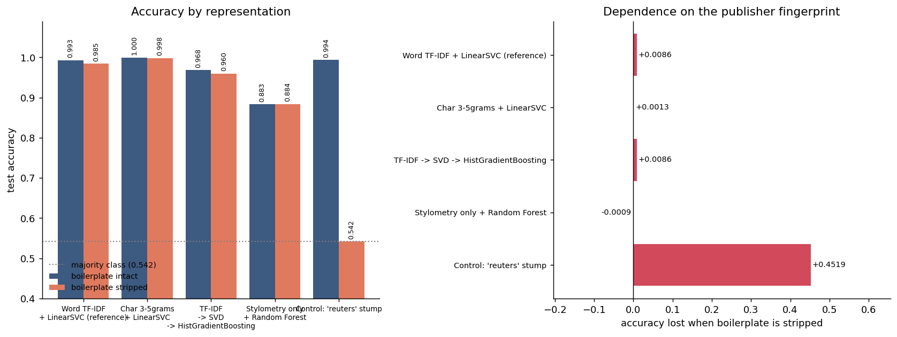

# Alternative Baselines - Does the Representation Matter?

Generated by `python src/alt_models.py`. Split reproduced from
`models/run_metadata.json` (31,278 train / 7,820 test,
`random_state=42`). Full per-condition numbers: `reports/alt_models_table.csv`.
Fitted estimators: `models/alt/`.

## Why this file exists

The project's headline comparison - Naive Bayes vs SVM vs Logistic Regression -
varies the classifier and holds the representation fixed. All three read the same
word-level TF-IDF matrix. That is one experiment reported three times. If the
feature space is the thing carrying the leakage, every one of those models leaks
by the same amount and the comparison between them cannot reveal it.

The models below change the representation instead:

| model | what it reads |
|---|---|
| Word TF-IDF + LinearSVC (reference) | linear, sparse words |
| Char 3-5grams + LinearSVC | linear, sparse characters |
| TF-IDF -> SVD -> HistGradientBoosting | non-linear, dense topics |
| Stylometry only + Random Forest | non-linear, 10 dense counts |
| Control: 'reuters' stump | one binary feature |

`Word TF-IDF + LinearSVC (reference)` is not a new idea - it is a re-fit of the
existing SVM, present only to prove the split was rebuilt correctly (reference model 0.9932 vs stored SVM 0.9932 (difference 0.0000)).
The SVD step keeps 250 components explaining 37.2% of the TF-IDF variance.

## Headline comparison (boilerplate intact)

| model | accuracy | precision | recall | f1 | roc_auc | representation | source |
|---|---|---|---|---|---|---|---|
| Naive Bayes | 0.9422 | 0.9463 | 0.9472 | 0.9467 | 0.9860 | linear, sparse words | models/metrics.json |
| SVM (Linear, calibrated) | 0.9932 | 0.9936 | 0.9939 | 0.9937 | 0.9995 | linear, sparse words | models/metrics.json |
| Logistic Regression | 0.9867 | 0.9832 | 0.9925 | 0.9878 | 0.9989 | linear, sparse words | models/metrics.json |
| Word TF-IDF + LinearSVC (reference) | 0.9932 | 0.9936 | 0.9939 | 0.9937 | 0.9995 | linear, sparse words | src/alt_models.py |
| Char 3-5grams + LinearSVC | 0.9996 | 0.9998 | 0.9995 | 0.9996 | 1.0000 | linear, sparse characters | src/alt_models.py |
| TF-IDF -> SVD -> HistGradientBoosting | 0.9683 | 0.9633 | 0.9788 | 0.9710 | 0.9955 | non-linear, dense topics | src/alt_models.py |
| Stylometry only + Random Forest | 0.8832 | 0.8807 | 0.9075 | 0.8939 | 0.9524 | non-linear, 10 dense counts | src/alt_models.py |
| Control: 'reuters' stump | 0.9940 | 0.9904 | 0.9986 | 0.9945 | 0.9936 | one binary feature | src/alt_models.py |

Precision/recall/F1 are for the positive class (`real` = 1). The first three rows
are read from `models/metrics.json`; the rest were fitted by this script on the
same split.

Read that table alongside the two baselines `train.py` already records on this
split: majority class **0.5421**,
one-rule "mentions Reuters" **0.9940**.

The control row is the one to read first. A depth-1 decision tree over a single binary feature - "does the text contain the word reuters" - scores **0.9940**, which beats 6 of the 7 other models in the table. Nothing above it should be described as a success. Changing the representation from words to characters to dense components barely changes the outcome - the 3 text-reading models span 0.9683 to 0.9996 accuracy, a spread of 0.0313 - because none of these models is solving the stated problem. They are finding the same shortcut through it from different directions.

## The strip experiment



Every model was fitted twice on the **same articles**: once as-is, once after `preprocessing.strip_source_boilerplate()` removed wire datelines, agency tags, editor sign-offs and blog-footer cruft. Stripping happens after the split membership is fixed, so both runs are scored on the identical 7,820 test articles - loading the corpus with `strip_boilerplate=True` instead would change which rows survive de-duplication and would silently compare two different test sets.

| model | acc_intact | acc_stripped | acc_drop | f1_intact | f1_stripped |
|---|---|---|---|---|---|
| Word TF-IDF + LinearSVC (reference) | 0.9932 | 0.9847 | 0.0086 | 0.9937 | 0.9859 |
| Char 3-5grams + LinearSVC | 0.9996 | 0.9983 | 0.0013 | 0.9996 | 0.9985 |
| TF-IDF -> SVD -> HistGradientBoosting | 0.9683 | 0.9597 | 0.0086 | 0.9710 | 0.9632 |
| Stylometry only + Random Forest | 0.8832 | 0.8841 | -0.0009 | 0.8939 | 0.8949 |
| Control: 'reuters' stump | 0.9940 | 0.5421 | 0.4519 | 0.9945 | 0.7030 |

Largest drop among the non-control models: **Word TF-IDF + LinearSVC (reference)**, +0.0086. Smallest: **Stylometry only + Random Forest**, -0.0009.

The prediction going in was that the vocabulary-based models would fall sharply once the fingerprint was gone. **They did not.** Every model gives up between -0.0009 and 0.0086 accuracy and none finishes below 0.8841. That is not good news. Stripping genuinely removes `(Reuters)` - the control proves it, falling to the majority-class floor - but the corpus is full of redundant tells the stripper does not touch: `getty images`, `pic.twitter.com`, photographer bylines, and seven subject categories each exclusive to one class (`eda.py`, sections 2 and 6). Remove one tell and the models key on the next. A small drop here is evidence that the leakage is over-determined, **not** evidence that the models were doing something legitimate all along.

The control drops from 0.9940 to 0.5421 - stripping deletes the word 'reuters' outright, so the stump has a constant feature and can only predict the majority class. That is the sanity check that the stripping actually did what it claims.

## The stylometry model is the number to quote

`Stylometry only + Random Forest` sees no words at all - ten counts per article
(exclamation marks, question marks, quote marks, ALL-CAPS words and their ratios,
digit ratio, upper-case character ratio, word count, mean word length, sentence
count). It cannot see `(Reuters)`, cannot see a dateline, cannot see vocabulary.
It scores **88.3%**.

Two things follow, and they point in opposite directions:

1. `eda.py` reported that fake articles carry ~13x the exclamation marks, ~12x the
   question marks and ~3x the ALL-CAPS ratio of real ones. That is real, measurable
   signal, and this model confirms it converts into classification accuracy far
   above the 54.2% majority-class floor.
2. It is still not a measurement of "can a machine detect fake news". It is a
   measurement of "can a machine tell Reuters wire copy from partisan blog copy",
   which is a formatting question. Wire services have style guides; the blogs in
   this corpus do not. A fabricated article written to AP style would sail past
   this model, and a real local-news report with an excited headline would not.

Stripping the boilerplate moves it by -0.0009 (to 0.8841), which is what you would expect from a model that never had access to the fingerprint in the first place. The small residual movement is real, not noise in the fit: datelines like `WASHINGTON (Reuters) -` contain an ALL-CAPS city name, so removing them nudges `allcaps_words` and `upper_char_ratio` on the real side.

The stylometry number is more honest than the 99% figures because it is not
contaminated by the publisher tag. It is still not an honest estimate of the actual
task - just a less dishonest one.

### What the stylometry model actually keyed on

Permutation importance on the test set (mean accuracy lost when a single feature
is shuffled). Permutation rather than the tree's built-in impurity importance,
because impurity importance is biased towards features with more distinct values -
and these features range from small integer counts to continuous ratios.

| feature | boilerplate intact | boilerplate stripped |
|---|---|---|
| question_count | 0.1025 | 0.1054 |
| avg_word_len | 0.0769 | 0.0786 |
| exclamation_count | 0.0494 | 0.0505 |
| upper_char_ratio | 0.0434 | 0.0436 |
| n_words | 0.0366 | 0.0397 |
| n_sentences | 0.0218 | 0.0254 |
| digit_ratio | 0.0141 | 0.0148 |
| allcaps_words | 0.0112 | 0.0114 |
| allcaps_ratio | 0.0055 | 0.0063 |
| quote_count | -0.0003 | -0.0001 |

## What this does and does not establish

- **Establishes:** the choice of representation is close to irrelevant on this
  dataset - the 3 text-reading models span 0.9683 to 0.9996 accuracy, a spread of 0.0313, and the one-keyword control sits inside that range. When
  models this structurally different agree this closely, they are agreeing about the
  data, not about the problem. The original three-model comparison was never going
  to surface that, because varying only the loss function cannot tell you whether
  the features are the problem.
- **Establishes:** the leakage is not an artifact of the word-level TF-IDF setup.
  Character n-grams pick it up too - the string `(Reuters)` is as visible to a
  5-character window as it is to a word tokenizer.
- **Does not establish:** that any of these would work on news from a different
  source, period or topic. Every number here is in-distribution. The stripped
  condition removes one known fingerprint; it does not remove the fact that the
  two halves of the corpus were scraped from different places, cover disjoint
  subject categories, and span different date ranges (`eda.py`, sections 2 and 4).
- **Does not establish:** anything about truthfulness. Nothing in this file, or in
  this repository, reads a claim and checks whether it is true.

## Method notes worth knowing before quoting anything here

- The character model n-grams only the first 1500
  characters of each article, purely for runtime. That window contains the dateline,
  which is where the fingerprint lives, so the truncation makes the char model look
  *better*, not worse. Pass `--char-truncate 0` to use whole articles.
- `char_wb` runs with `lowercase=False`. Case is stylistic evidence and lowercasing
  would throw it away, which would defeat the point of having a character model.
- The stylometry features are computed on raw article text, not on `clean_text()`
  output - cleaning deletes punctuation, digits and case, i.e. nine of the ten
  features.
- No hyperparameter search was run on any of these. They are defaults. Tuning them
  would move the numbers by fractions of a point and would not touch the finding,
  which is about the data.

## Reproducing

```bash
python src/alt_models.py                       # both conditions, full corpus
python src/alt_models.py --conditions raw      # skip the strip experiment
python src/alt_models.py --skip-char           # skip the slow character model
python src/alt_models.py --sample 6000         # fast, not comparable to metrics.json
```

Total runtime for this run: 376s.
