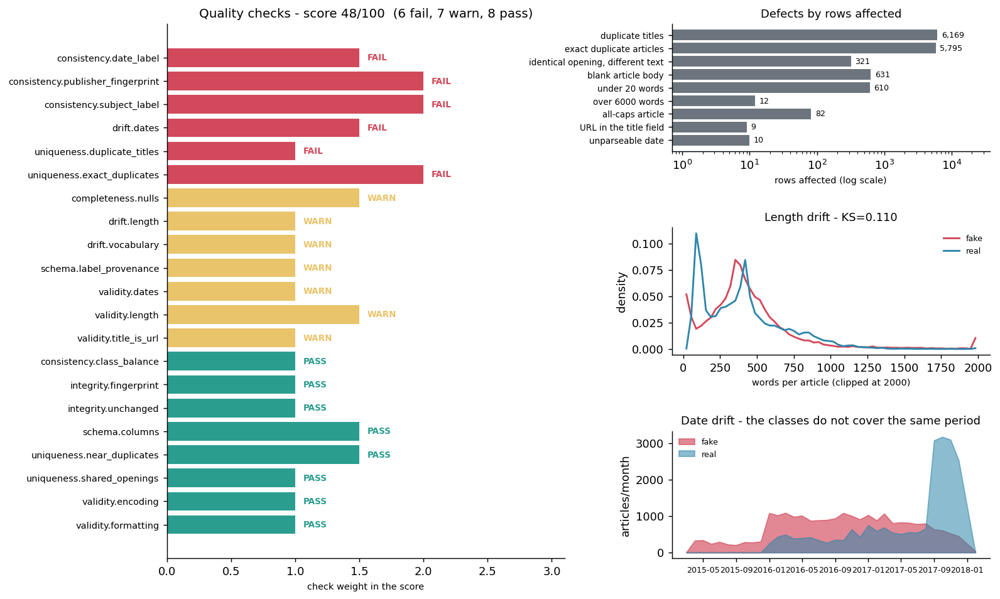

# Data Quality Report

Generated by `python src/data_quality.py`. Machine-readable copy:
`reports/data_quality.json`. Figure: `reports/figures/data_quality.png`.

## Verdict

**Quality score: 48.1/100** over 21 checks
(6 FAIL, 7 WARN,
8 PASS, 0 INFO).

Checks are weighted (2.0 for anything that can invalidate a training run, 1.0
for the rest); a PASS earns full weight, a WARN half, a FAIL none. The score is
not a grade for the modelling work - it is a statement about the inputs.

Failing checks:

- `uniqueness.exact_duplicates` - No exact duplicate articles
- `uniqueness.duplicate_titles` - Headlines are distinct
- `consistency.subject_label` - Subject categories are shared across classes
- `consistency.date_label` - Publication dates overlap across classes
- `consistency.publisher_fingerprint` - No single token identifies a class
- `drift.dates` - Publication date distributions agree

Running `python src/data_quality.py --strict` exits **1** on this
data, so it can be used as a pre-training gate.





## 1. Integrity - which bytes were profiled

| file | sha256 | bytes | modified_utc | rows |
|---|---|---|---|---|
| Fake.csv | bebf8bcfe95678bf... | 62,789,876 | 2026-08-11T08:59:05.679516+00:00 | 23481 |
| True.csv | ba0844414a65dc6a... | 53,582,940 | 2026-08-11T08:59:05.987556+00:00 | 21417 |

**Source files fingerprinted** - `PASS`  
2 source files hashed (SHA-256) and recorded.  
*What to do:* Quote these hashes next to any reported accuracy figure.

**Data unchanged since last run** - `PASS`  
All source files byte-identical to the previous run.  
*What to do:* If the data changed, retrain and re-evaluate; cached models are stale.


## 2. Schema conformance

Expected schema (the contract these files are checked against, defined as
`EXPECTED_SCHEMA` in `src/data_quality.py`):

| column | dtype | nullable | constraints | description |
|---|---|---|---|---|
| title | string | False | min_len=1, max_len=600, no_urls=True | Article headline as scraped. |
| text | string | False | min_words=20, max_words=6000 | Article body. Concatenated with `title` to form the `content` field the models are trained on. |
| subject | string | False | categorical=True, max_cardinality=12 | Publisher-assigned topic category. Metadata only - never used as a feature, because it leaks the label. |
| date | string (free-text date) | False | parseable=True, min=2015-01-01, max=2018-12-31 | Publication date. Stored as free text in several formats ('December 31, 2017', '31-Dec-17'), so it is parsed leniently rather than typed. |

**Column set and dtypes match EXPECTED_SCHEMA** - `PASS`  
Both files carry exactly the four expected columns (title, text, subject, date), all object/string dtype.  
*What to do:* Update EXPECTED_SCHEMA deliberately, or fix the extract.

**Label is implicit in the filename** - `WARN`  
Neither CSV contains a label column; the label comes from which file a row was read from. Any row that moves between files silently changes class, and there is no way to detect that from the data.  
*What to do:* Materialise an explicit `label` column (and a source_file column) when the two CSVs are merged, so provenance survives the join.


## 3. Completeness

| file | column | rows | nulls | empty_or_blank | empty_rate |
|---|---|---|---|---|---|
| Fake.csv | title | 23481 | 0 | 0 | 0.000% |
| Fake.csv | text | 23481 | 0 | 630 | 2.683% |
| Fake.csv | subject | 23481 | 0 | 0 | 0.000% |
| Fake.csv | date | 23481 | 0 | 0 | 0.000% |
| True.csv | title | 21417 | 0 | 0 | 0.000% |
| True.csv | text | 21417 | 0 | 1 | 0.005% |
| True.csv | subject | 21417 | 0 | 0 | 0.000% |
| True.csv | date | 21417 | 0 | 0 | 0.000% |

**No missing or blank required fields** - `WARN`  
631 blank cells across 44,898 rows. Worst column: `text` in Fake.csv at 2.68% (630 rows).  
*What to do:* Rows with an empty `text` still carry a title, so `content` is non-empty and they survive load_data(). Decide explicitly whether a headline-only row is a valid training example - currently it is treated as one.


## 4. Uniqueness

**No exact duplicate articles** - `FAIL`  
5,795 of 44,898 rows (12.9%) are exact duplicates of an earlier row. 0 article texts appear under both labels.  
*What to do:* load_data(drop_duplicates=True) removes these, and it must run BEFORE train_test_split - otherwise the same article lands on both sides of the split and test accuracy is inflated.

**Headlines are distinct** - `FAIL`  
6,169 repeated headlines (13.7%). After exact-body deduplication 374 repeated headlines remain, i.e. different bodies published under the same headline.  
*What to do:* Same-headline/different-body pairs are usually a story and its update; they are near-duplicates for training purposes.

**No near-duplicate articles** - `PASS`  
Exhaustive, whole corpus: normalising case, punctuation and whitespace turns 272 further rows (0.6%) into duplicates that `drop_duplicates("content")` leaves in place. Sampled, MinHash+LSH over 6,000 of the 39,103 unique articles: 12 pairs at estimated Jaccard >= 0.80, touching 24 articles (0.4% of the sample), of which 10 are the punctuation-only kind and 0 straddle the fake/real boundary. That sample covers only 2.4% of all possible pairs, so the sampled rate is a lower bound, not an estimate - the exhaustive number above is the one to act on.  
*What to do:* Exact deduplication is not enough: near-duplicates split across the train/test boundary leak just as effectively. Deduplicate on a hash of the normalised text - that is O(n), needs no threshold, and catches the punctuation-only pairs for free. Raise --near-dup-sample to search harder for the genuinely fuzzy ones.

**Articles do not share identical openings** - `PASS`  
6,116 rows repeat an earlier row's first 120 normalised characters. 5,795 of those are exact duplicates already counted above, leaving 321 rows (0.7%) that open identically but are not identical texts.  
*What to do:* Cheap linear screen: one hash per row, no pairwise comparison. Run it before the MinHash join to see whether the expensive step is even needed.


Highest-similarity near-duplicate pairs found in the sample:

| similarity | same_after_normalising | labels | title_a | title_b |
|---|---|---|---|---|
| 1.000 | yes | real/real | Taiwan the most important issue in Sino-U.S. ties, Chin | Taiwan the most important issue in Sino-U.S. ties, Chin |
| 1.000 | yes | real/real | Former intelligence officials say Trump is being manipu | Former intelligence officials say Trump is being manipu |
| 1.000 | yes | real/real | Trump says U.S. upholds and sticks to 'one China' polic | Trump says U.S. upholds and sticks to 'one China' polic |
| 1.000 | yes | real/real | Trump says will discuss military issues, Qatar with Kuw | Trump says will discuss military issues, Qatar with Kuw |
| 1.000 | yes | real/real | Trump says North Korea's Kim 'will be tested like never | Trump says North Korea's Kim 'will be tested like never |
| 1.000 | yes | real/real | Trump fires back at Britain's May: 'Don't focus on me' | Trump fires back at Britain's May: 'Don't focus on me' |
| 1.000 | yes | real/real | Trump says Cuba 'did some bad things' aimed at U.S. dip | Trump says Cuba 'did some bad things' aimed at U.S. dip |
| 1.000 | yes | real/real | Trump says 'only one thing will work' with North Korea | Trump says 'only one thing will work' with North Korea |
| 1.000 | yes | real/real | What's a 'dotard' anyway? Kim's insult to Trump | What's a 'dotard' anyway? Kim's insult to Trump |
| 1.000 | yes | real/real | China says confident in economic relations with U.S. ah | China says confident in economic relations with U.S. ah |
| 0.984 | no | real/real | Factbox: The race to the U.S. presidential nominations: | Factbox: The race to the U.S. presidential nominations: |
| 0.812 | no | real/real | Q&A: What we know about U.S. probes of Russian meddling | What we know about U.S. probes of Russian meddling in 2 |

## 5. Validity

**Dates parse and fall in the declared range** - `WARN`  
10 of 44,898 date values (0.022%) do not parse; 9 of those contain a URL instead of a date. 0 parsed dates fall outside 2015-01-01..2018-12-31.  
*What to do:* These rows are scraper failures - the URL landed in both `title` and `date`. Drop them; they carry no article text worth training on.

**Headlines are headlines, not URLs** - `WARN`  
9 rows have a URL in the `title` field.  
*What to do:* Same scraper failure as the unparseable dates - the two overlap.

**Text decodes cleanly as UTF-8** - `PASS`  
No U+FFFD replacement characters, no mojibake sequences and no C0 control characters (0 total). 19 cells contain zero-width or bidi format characters, and 25,575 contain non-ASCII characters - almost all of them curly quotes, which clean_text() strips anyway.  
*What to do:* Normalise Unicode (NFKC) and strip format characters at load time if the vectorizer is ever changed to keep punctuation.

**Article length is plausible** - `WARN`  
610 articles (1.4%) are under 20 words, 12 are over 6,000. 631 rows have an empty body and consist of the headline alone. Median 385 words, max 8,389.  
*What to do:* A headline-only row teaches the model headline style, not article content. Either drop them or record that the effective corpus is mixed.

**Articles are not all-caps or mostly punctuation** - `PASS`  
82 articles are more than 60% uppercase characters and 3 are less than 50% letters. Both skew heavily fake (82 and 1 respectively), so they are a style signal as much as a defect.  
*What to do:* Do not silently delete these - they are real examples of the fake style. Flag them so the effect on the model can be measured.


Encoding profile per column:

| file | column | replacement_char | mojibake | control_char | invisible_char | non_ascii |
|---|---|---|---|---|---|---|
| Fake.csv | title | 0 | 0 | 0 | 4 | 14676 |
| Fake.csv | text | 0 | 0 | 0 | 0 | 0 |
| True.csv | title | 0 | 0 | 0 | 1 | 50 |
| True.csv | text | 0 | 0 | 0 | 14 | 10849 |

## 6. Consistency

| subject | fake | real | exclusive_to |
|---|---|---|---|
| Government News | 1570 | 0 | fake only |
| Middle-east | 778 | 0 | fake only |
| News | 9050 | 0 | fake only |
| US_News | 783 | 0 | fake only |
| left-news | 4459 | 0 | fake only |
| politics | 6841 | 0 | fake only |
| politicsNews | 0 | 11272 | real only |
| worldnews | 0 | 10145 | real only |

**Subject categories are shared across classes** - `FAIL`  
8 of 8 subject values appear in exactly one class. Predicting the majority class of an article's `subject` scores 100.00% accuracy on the whole corpus, with no text and no model involved.  
*What to do:* `subject` must never be used as a feature, and its presence means the two files came from different scrapes rather than one sampling frame. Treat it as evidence about provenance, not as metadata.

**No single token identifies a class** - `FAIL`  
The literal string `(Reuters)` appears in 99.2% of real articles and 0.0% of fake ones. "Contains it, therefore real" scores 99.60% on the whole corpus with no model. The two classes are not fake vs real news; they are one wire service vs a set of blogs.  
*What to do:* Every accuracy figure from this dataset must be quoted next to this number. `python src/train.py --strip-boilerplate` retrains without the marker; the drop is the leakage share. See `reports/eda_report.md` for the full marker sweep.

**Publication dates overlap across classes** - `FAIL`  
Fake articles span 2015-03-31..2018-02-19, real articles 2016-01-13..2017-12-31. 2,926 articles (6.5%) fall outside the shared window, and 100.0% of them are fake - the date alone classifies them.  
*What to do:* Restrict both classes to the shared window before drawing any conclusion about model skill, or accept that part of the accuracy is calendar arithmetic.

**Classes are reasonably balanced** - `PASS`  
fake 23,481 / real 21,417; minority class is 47.7% of the corpus. No resampling needed.


## 7. Distribution drift - are these two files one population?

The question this section answers is not "do fake and real articles differ" -
of course they do. It is the narrower and more damaging one: **were these two
files drawn from the same sampling frame?** If they were not, a classifier can
separate them by provenance instead of by truthfulness, and in-distribution
accuracy cannot tell the difference.

**Article length distributions agree** - `WARN`  
KS statistic 0.110 (p=3.65e-118), Jensen-Shannon distance 0.298 on the length histogram. Median 390 words fake vs 377 real - a 13-word difference. A KS statistic of 0.11 is a small effect: length is the dimension on which these two files come closest to agreeing, and it is also the only one a scraper does not control.  
*What to do:* With n>17,000 per class the KS p-value is effectively zero for any difference at all, so read the statistic (effect size), not the p-value.

**Vocabulary distributions agree** - `WARN`  
Jensen-Shannon distance 0.397 between the two unigram distributions on a 8,000-article sample; term-set Jaccard overlap 0.849 over the 20,000 terms that survive min_df=3. (`src/eda.py` reports Jaccard 0.34 for the same corpus - that figure includes the long tail of once-seen tokens, which is where the two files diverge most. Neither number is wrong; they measure different vocabularies.) Some vocabulary difference is expected between real and fabricated news; the question is whether it is topical or publisher-specific, and the leakage audit in `src/eda.py` says largely the latter.  
*What to do:* Re-run this after `strip_source_boilerplate()` to see how much of the gap is Reuters datelines rather than content.

**Publication date distributions agree** - `FAIL`  
Jensen-Shannon distance 0.482 on the monthly publication histogram - which on its own looks unremarkable, because both classes are dense through the middle of the period. The decisive number is that 11 of 35 months (31%) contain articles from one class only. A single divergence statistic hides a hard calendar boundary; this check reports both and takes the worse verdict.  
*What to do:* Sample both classes from the same calendar window, or state plainly that the model has a date confound it cannot separate.


The pattern across the three drift checks is the informative part. Length is the one
dimension on which the two files agree, and it is also the one dimension a scraper
cannot control. Everything that carries provenance - topic taxonomy, publication window,
vocabulary - separates almost perfectly. That is the signature of two independently
collected corpora that were concatenated and relabelled, not of one population split by
a truth label.

## 8. All checks

| check | category | status | weight | what it means |
|---|---|---|---|---|
| integrity.fingerprint | integrity | PASS | 1.0 | 2 source files hashed (SHA-256) and recorded. |
| integrity.unchanged | integrity | PASS | 1.0 | All source files byte-identical to the previous run. |
| schema.columns | schema | PASS | 1.5 | Both files carry exactly the four expected columns (title, text, subject, date), all object/string dtype. |
| schema.label_provenance | schema | WARN | 1.0 | Neither CSV contains a label column; the label comes from which file a row was read from. Any row that moves between files silently changes class, and there is no way to detect that from the data. |
| completeness.nulls | completeness | WARN | 1.5 | 631 blank cells across 44,898 rows. Worst column: `text` in Fake.csv at 2.68% (630 rows). |
| uniqueness.exact_duplicates | uniqueness | FAIL | 2.0 | 5,795 of 44,898 rows (12.9%) are exact duplicates of an earlier row. 0 article texts appear under both labels. |
| uniqueness.duplicate_titles | uniqueness | FAIL | 1.0 | 6,169 repeated headlines (13.7%). After exact-body deduplication 374 repeated headlines remain, i.e. different bodies published under the same headline. |
| uniqueness.near_duplicates | uniqueness | PASS | 1.5 | Exhaustive, whole corpus: normalising case, punctuation and whitespace turns 272 further rows (0.6%) into duplicates that `drop_duplicates("content")` leaves in place. Sampled, MinHash+LSH over 6,000 of the 39,103 unique articles: 12 pairs at estimated Jaccard >= 0.80, touching 24 articles (0.4% of the sample), of which 10 are the punctuation-only kind and 0 straddle the fake/real boundary. That sample covers only 2.4% of all possible pairs, so the sampled rate is a lower bound, not an estimate - the exhaustive number above is the one to act on. |
| uniqueness.shared_openings | uniqueness | PASS | 1.0 | 6,116 rows repeat an earlier row's first 120 normalised characters. 5,795 of those are exact duplicates already counted above, leaving 321 rows (0.7%) that open identically but are not identical texts. |
| validity.dates | validity | WARN | 1.0 | 10 of 44,898 date values (0.022%) do not parse; 9 of those contain a URL instead of a date. 0 parsed dates fall outside 2015-01-01..2018-12-31. |
| validity.title_is_url | validity | WARN | 1.0 | 9 rows have a URL in the `title` field. |
| validity.encoding | validity | PASS | 1.0 | No U+FFFD replacement characters, no mojibake sequences and no C0 control characters (0 total). 19 cells contain zero-width or bidi format characters, and 25,575 contain non-ASCII characters - almost all of them curly quotes, which clean_text() strips anyway. |
| validity.length | validity | WARN | 1.5 | 610 articles (1.4%) are under 20 words, 12 are over 6,000. 631 rows have an empty body and consist of the headline alone. Median 385 words, max 8,389. |
| validity.formatting | validity | PASS | 1.0 | 82 articles are more than 60% uppercase characters and 3 are less than 50% letters. Both skew heavily fake (82 and 1 respectively), so they are a style signal as much as a defect. |
| consistency.subject_label | consistency | FAIL | 2.0 | 8 of 8 subject values appear in exactly one class. Predicting the majority class of an article's `subject` scores 100.00% accuracy on the whole corpus, with no text and no model involved. |
| consistency.date_label | consistency | FAIL | 1.5 | Fake articles span 2015-03-31..2018-02-19, real articles 2016-01-13..2017-12-31. 2,926 articles (6.5%) fall outside the shared window, and 100.0% of them are fake - the date alone classifies them. |
| consistency.publisher_fingerprint | consistency | FAIL | 2.0 | The literal string `(Reuters)` appears in 99.2% of real articles and 0.0% of fake ones. "Contains it, therefore real" scores 99.60% on the whole corpus with no model. The two classes are not fake vs real news; they are one wire service vs a set of blogs. |
| consistency.class_balance | consistency | PASS | 1.0 | fake 23,481 / real 21,417; minority class is 47.7% of the corpus. No resampling needed. |
| drift.length | drift | WARN | 1.0 | KS statistic 0.110 (p=3.65e-118), Jensen-Shannon distance 0.298 on the length histogram. Median 390 words fake vs 377 real - a 13-word difference. A KS statistic of 0.11 is a small effect: length is the dimension on which these two files come closest to agreeing, and it is also the only one a scraper does not control. |
| drift.vocabulary | drift | WARN | 1.0 | Jensen-Shannon distance 0.397 between the two unigram distributions on a 8,000-article sample; term-set Jaccard overlap 0.849 over the 20,000 terms that survive min_df=3. (`src/eda.py` reports Jaccard 0.34 for the same corpus - that figure includes the long tail of once-seen tokens, which is where the two files diverge most. Neither number is wrong; they measure different vocabularies.) Some vocabulary difference is expected between real and fabricated news; the question is whether it is topical or publisher-specific, and the leakage audit in `src/eda.py` says largely the latter. |
| drift.dates | drift | FAIL | 1.5 | Jensen-Shannon distance 0.482 on the monthly publication histogram - which on its own looks unremarkable, because both classes are dense through the middle of the period. The decisive number is that 11 of 35 months (31%) contain articles from one class only. A single divergence statistic hides a hard calendar boundary; this check reports both and takes the worse verdict. |

## 9. Using this as a pipeline gate

```
python src/data_quality.py --strict && python src/train.py
```

`--strict` returns 1 when any check FAILs, so `train.py` never runs on data
that has not been profiled. On the dataset as shipped that gate is closed, and
correctly so: 6 checks fail.

`reports/data_quality.json` carries the same verdicts in machine-readable form -
`gate.strict_exit_code`, `score`, and a `metrics` block per check - so a CI job
can read a specific number rather than grep this file.

Two honest ways forward, and one dishonest one. Fix the data: deduplicate before
splitting rather than after, drop the scraper-failure rows, restrict both classes to the
shared date window, and retrain with `--strip-boilerplate`. Or keep the data as it is
and report every accuracy figure next to the one-rule baseline it has to beat. What is
not defensible is quoting the headline accuracy on its own, because on this dataset that
number is mostly a measure of how well the model recognises a wire service.

Rows profiled: 44,898.
Every threshold used is recorded in `reports/data_quality.json` under
`thresholds`, so the calibration can be argued with directly.
