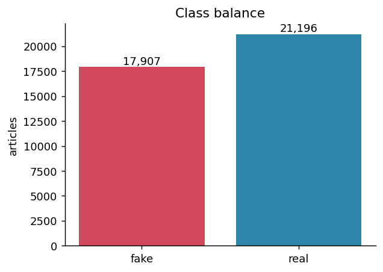
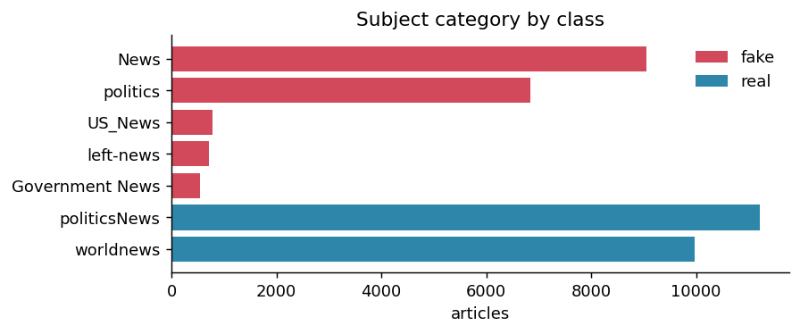
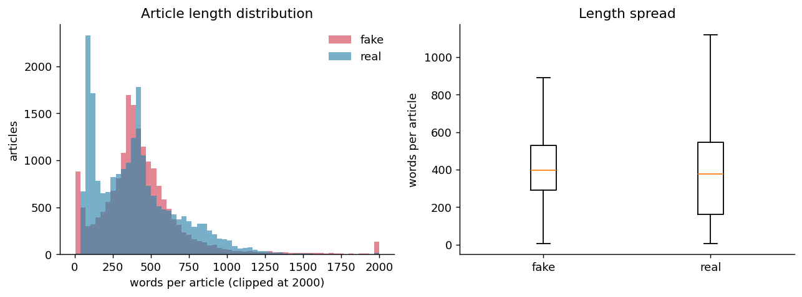
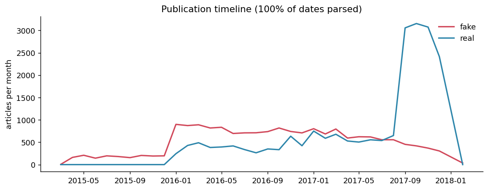
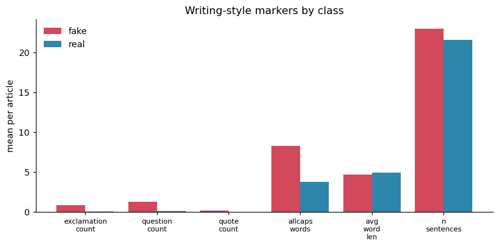
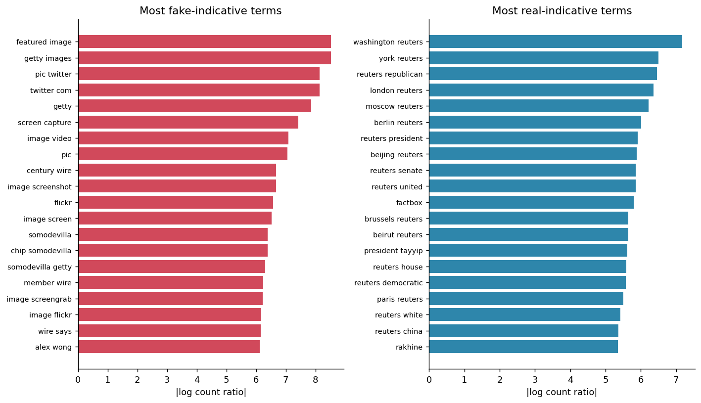
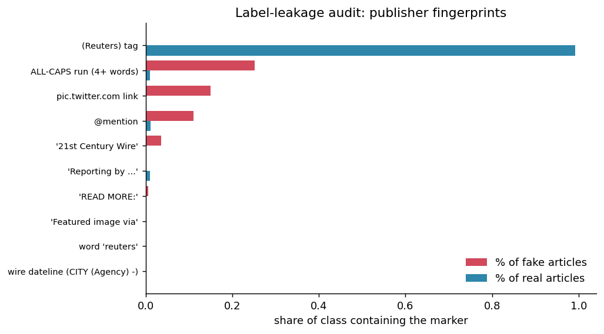

# Exploratory Data Analysis - Fake News Dataset

Generated by `python src/eda.py`. Tables live in `reports/eda_tables/`,
figures in `reports/figures/`.

Rows analysed: **39,103**

## 1. Class balance and data quality

| class | articles | share | median_words | mean_words | empty_titles |
|---|---|---|---|---|---|
| fake | 17907 | 0.458 | 397.000 | 442.657 | 0 |
| real | 21196 | 0.542 | 376.000 | 403.561 | 0 |

44,898 rows loaded, **5,795 exact duplicate articles** (12.9%). Duplicates must be dropped *before* the train/test split - otherwise the same article lands on both sides and test accuracy is inflated.

## 2. Topic coverage

7 of 7 subject categories appear in **only one class**.
Where that is true, `subject` alone is a perfect predictor - which tells you the
two halves of the dataset were scraped from different places, not sampled from
one population.

| subject | fake | real | exclusive_to |
|---|---|---|---|
| News | 9050 | 0 | fake only |
| politics | 6837 | 0 | fake only |
| US_News | 783 | 0 | fake only |
| left-news | 705 | 0 | fake only |
| Government News | 532 | 0 | fake only |
| politicsNews | 0 | 11216 | real only |
| worldnews | 0 | 9980 | real only |

## 3. Article length

Median length: fake 397 words,
real 376 words.

## 4. Timeline

100% of `date` values parsed cleanly.

## 5. Writing style

Mean per-article values. `fake/real` > 1 means the marker is more common in fake articles.

| feature | fake | real | fake/real |
|---|---|---|---|
| n_words | 442.657 | 403.561 | 1.097 |
| avg_word_len | 4.689 | 4.938 | 0.950 |
| n_sentences | 22.993 | 21.578 | 1.066 |
| exclamation_count | 0.855 | 0.063 | 13.563 |
| question_count | 1.263 | 0.107 | 11.852 |
| quote_count | 0.170 | 0.019 | 9.099 |
| allcaps_words | 8.275 | 3.781 | 2.188 |
| allcaps_ratio | 0.038 | 0.012 | 3.173 |
| digit_ratio | 0.007 | 0.006 | 1.138 |
| upper_char_ratio | 0.069 | 0.042 | 1.641 |

## 6. Most discriminative terms

Log count ratio - how much more often a term appears in one class than the other.

|  | fake_term | fake_log_ratio | fake_docs | real_term | real_log_ratio | real_docs |
|---|---|---|---|---|---|---|
| 0 | featured image | 8.53 | 7948 | washington reuters | -7.17 | 6643 |
| 1 | getty images | 8.52 | 3942 | york reuters | -6.50 | 845 |
| 2 | pic twitter | 8.14 | 2692 | reuters republican | -6.46 | 814 |
| 3 | twitter com | 8.14 | 2690 | london reuters | -6.35 | 731 |
| 4 | getty | 7.85 | 4052 | moscow reuters | -6.22 | 639 |
| 5 | screen capture | 7.42 | 1315 | berlin reuters | -6.01 | 520 |
| 6 | image video | 7.10 | 947 | reuters president | -5.92 | 2366 |
| 7 | pic | 7.05 | 2727 | beijing reuters | -5.89 | 458 |
| 8 | century wire | 6.67 | 620 | reuters senate | -5.86 | 445 |
| 9 | image screenshot | 6.67 | 616 | reuters united | -5.86 | 444 |
| 10 | flickr | 6.57 | 561 | factbox | -5.80 | 420 |
| 11 | image screen | 6.52 | 531 | brussels reuters | -5.65 | 361 |
| 12 | somodevilla | 6.39 | 466 | beirut reuters | -5.65 | 359 |
| 13 | chip somodevilla | 6.39 | 465 | president tayyip | -5.61 | 347 |
| 14 | somodevilla getty | 6.30 | 428 | reuters house | -5.59 | 338 |
| 15 | member wire | 6.23 | 400 | reuters democratic | -5.57 | 333 |
| 16 | image screengrab | 6.22 | 394 | paris reuters | -5.51 | 313 |
| 17 | image flickr | 6.18 | 377 | reuters white | -5.42 | 286 |
| 18 | wire says | 6.15 | 368 | reuters china | -5.37 | 273 |
| 19 | alex wong | 6.12 | 356 | rakhine | -5.35 | 267 |

Vocabulary: 84,726 distinct tokens in fake articles,
63,387 in real, 37,499 shared
(Jaccard 0.339).

## 7. Label leakage audit  <- read this one

| marker | in_fake | in_real | gap | one_rule_accuracy |
|---|---|---|---|---|
| (Reuters) tag | 0.000 | 0.992 | 0.992 | 0.995 |
| ALL-CAPS run (4+ words) | 0.252 | 0.010 | 0.242 | 0.652 |
| pic.twitter.com link | 0.150 | 0.000 | 0.150 | 0.611 |
| @mention | 0.111 | 0.012 | 0.099 | 0.587 |
| '21st Century Wire' | 0.035 | 0.000 | 0.035 | 0.558 |
| 'Reporting by ...' | 0.000 | 0.009 | 0.009 | 0.463 |
| 'READ MORE:' | 0.006 | 0.000 | 0.005 | 0.545 |
| 'Featured image via' | 0.002 | 0.000 | 0.002 | 0.543 |
| word 'reuters' | 0.000 | 0.001 | 0.001 | 0.458 |
| wire dateline (CITY (Agency) -) | 0.000 | 0.001 | 0.001 | 0.458 |

**Headline finding:** the marker `(Reuters) tag` appears in
99.2% of real articles and 0.0% of fake ones.
A one-line rule - "contains this marker, therefore real" - scores
**99.5% accuracy** on its own, with no machine
learning involved.

That number is the honest baseline any model here must be compared against. A TF-IDF
classifier reporting ~99% accuracy on this dataset has most likely learned the publisher
fingerprint, not the difference between truthful and fabricated reporting. Two things
follow: (1) retrain with `python src/train.py --strip-boilerplate` and compare - the
accuracy drop is the portion of performance that was leakage; (2) evaluate on a second,
independently-sourced dataset with `python src/cross_dataset_eval.py`, because in-
distribution accuracy cannot detect this failure at all.
