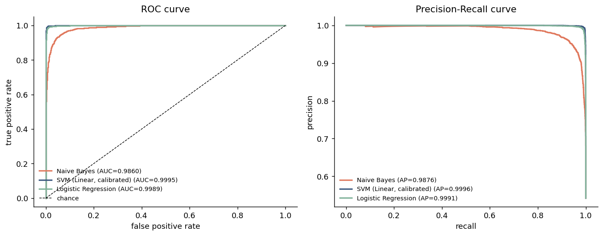
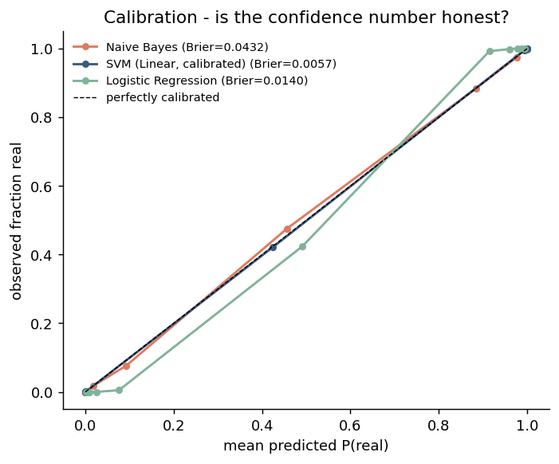
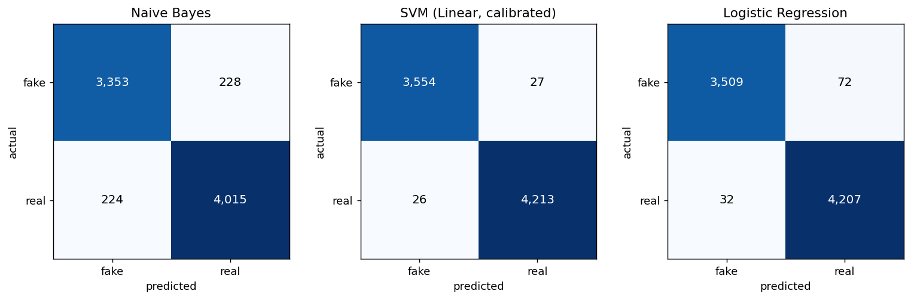
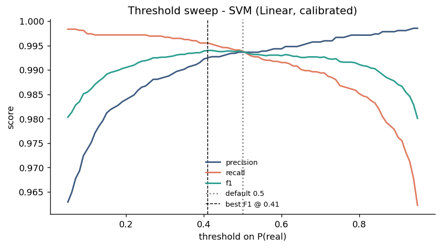

# Model Evaluation Report

Generated by `python src/evaluate.py`. Test split reproduced from
`models/run_metadata.json` (7,820 articles, `random_state=
42`), so these numbers match `models/metrics.json`.

Publisher boilerplate stripped during training: **False**

## Headline comparison

| model | accuracy | roc_auc | avg_precision | brier |
|---|---|---|---|---|
| Naive Bayes | 0.9422 | 0.9860 | 0.9876 | 0.0432 |
| SVM (Linear, calibrated) | 0.9932 | 0.9995 | 0.9996 | 0.0057 |
| Logistic Regression | 0.9867 | 0.9989 | 0.9991 | 0.0140 |

`brier` is the Brier score - mean squared error of the probability estimate.
Lower is better; it penalises a model that is confidently wrong far harder
than accuracy does.

## Discrimination: ROC and precision-recall

## Calibration

The app shows users a confidence percentage. This plot is the check on whether
that percentage means anything: points on the diagonal mean "90% confident" is
right about 90% of the time. Points below the diagonal mean the model is
overconfident, which is the dangerous direction for a misinformation tool.

## Confusion matrices

## Operating point

Best F1 for SVM (Linear, calibrated) is at threshold **0.41**
(default is 0.50). Raising the threshold trades recall for precision - useful
if a false "REAL" verdict is more costly than a false "FAKE" one.

## Cross-validated F1 (3-fold, training set)

| model | cv_f1_mean | cv_f1_std |
|---|---|---|
| Naive Bayes | 0.9483 | 0.0019 |
| SVM (Linear, calibrated) | 0.9923 | 0.0002 |
| Logistic Regression | 0.9862 | 0.0005 |

## Error analysis - the confident mistakes

### Naive Bayes

7820 test rows, 452 wrong. Full list: `reports/errors_nb.csv`

| actual | predicted | confidence | title |
|---|---|---|---|
| fake | real | 0.9998 | NORTH KOREA: Trump’s Recklessness Could Trigger All-Out Conflict on Ko |
| fake | real | 0.9997 | EXPERT CLAIMS N. KOREA’S SECOND MISSILE Test Demonstrates They Now Hav |
| fake | real | 0.9973 | IS OBAMA’S RADICAL AGENDA Responsible For State Department’s Misleadin |
| real | fake | 0.9922 | Trump gets skewered, Clinton finds support at TV's Emmy awards |
| fake | real | 0.9911 | US Coalition Airstrike on Syrian Army in Al-Tanf is Another Calculated |
| fake | real | 0.9906 | MARINE CORPS GENERAL WARNS U.S. TROOPS: “There’s A War Coming” |
| fake | real | 0.9889 | NEW LAW WILL PUNISH MUSLIM Migrants…Assimilate Or Get Out! |
| fake | real | 0.9882 | CONGRESS WARNED Threat of Nuclear EMP Attack Has Never Been Higher: “N |
### SVM (Linear, calibrated)

7820 test rows, 53 wrong. Full list: `reports/errors_svm.csv`

| actual | predicted | confidence | title |
|---|---|---|---|
| real | fake | 1.0000 | Russia's response to Trump leak reports: don't read U.S. newspapers |
| real | fake | 0.9982 | Highlights from Reuters' exclusive interview with Donald Trump |
| fake | real | 0.9963 | EGYPTIAN COURT SENTENCES MUSLIM BROTHERHOOD LEADER AND 13 OTHERS TO DE |
| fake | real | 0.9875 | IS OBAMA’S RADICAL AGENDA Responsible For State Department’s Misleadin |
| real | fake | 0.9852 | Jenner uses women's restroom at Trump property |
| fake | real | 0.9850 | ARIZONA BIKERS ARE ABOUT To Become Violent “Dreamers” Worst Nightmare  |
| fake | real | 0.9825 | EXPERT CLAIMS N. KOREA’S SECOND MISSILE Test Demonstrates They Now Hav |
| fake | real | 0.9809 | FORD’S NEW CEO SNUBS President Trump…Will Build Focus In China…Export  |
### Logistic Regression

7820 test rows, 104 wrong. Full list: `reports/errors_lr.csv`

| actual | predicted | confidence | title |
|---|---|---|---|
| fake | real | 0.9687 | EXPERT CLAIMS N. KOREA’S SECOND MISSILE Test Demonstrates They Now Hav |
| real | fake | 0.9561 | Highlights from Reuters' exclusive interview with Donald Trump |
| real | fake | 0.9336 | A Picture and its Story: Reaching out to rescue a Rohingya woman |
| fake | real | 0.9190 | FORD’S NEW CEO SNUBS President Trump…Will Build Focus In China…Export  |
| fake | real | 0.9119 | EGYPTIAN COURT SENTENCES MUSLIM BROTHERHOOD LEADER AND 13 OTHERS TO DE |
| fake | real | 0.9079 | IS OBAMA’S RADICAL AGENDA Responsible For State Department’s Misleadin |
| real | fake | 0.9023 | Russia's response to Trump leak reports: don't read U.S. newspapers |
| fake | real | 0.8929 | BREAKING: Activist Appeals Court Rules Against Trump…Trump Comes Out S |

## Reading these results honestly

Accuracy near 1.0 on this dataset is a warning sign, not a triumph. `src/eda.py`
shows a single-keyword rule scoring about the same, which means most of the
apparent skill is publisher fingerprinting. Two follow-ups make the evaluation
credible:

- `python src/train.py --strip-boilerplate` then re-run this script - the drop
  is the leakage share.
- `python src/cross_dataset_eval.py --data-file data/WELFake_Dataset.csv` -
  out-of-distribution accuracy is the only number that reflects real-world use.
