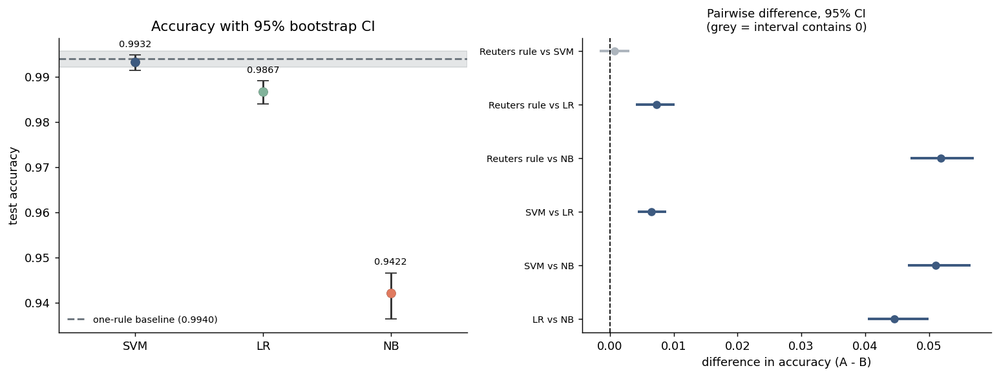

# Statistical Significance of Model Differences

Generated by `python src/significance.py`. Test split reproduced from
`models/run_metadata.json`: **7,820 articles**,
`random_state=42`, `test_size=0.2`.

Every accuracy below reproduces `models/metrics.json` exactly, so this is the same test split the models were scored on.

## Headline

SVM (Linear, calibrated), the best trained model, is **not statistically
distinguishable** from a one-line rule that greps for the word "Reuters" (0.9932 vs
0.9940; Holm-adjusted p = 0.5713, 95% CI on the difference [-0.0014, +0.0028], which
contains zero). The two disagree on only 78 of 7,820 test articles, and split those
near-evenly: 36 the model gets right and the rule misses, 42 the other way round. On
this test set the 5,000-feature TF-IDF pipeline buys nothing measurable over the
keyword.

## 1. Why McNemar and not a two-proportion test

Every system here is scored on **the same 7,820 test articles**. That makes the
comparisons paired, and the pairing carries most of the information: the models
agree on the overwhelming majority of articles, so the interesting quantity is
not "how often is each right" but "on the articles where they disagree, who is
right more often".

An unpaired two-proportion z-test throws that structure away. It treats the two
accuracy figures as if they came from two independent samples and computes a
standard error that is far too large, which makes it badly under-powered here -
it would call almost every difference on this test set insignificant regardless
of the evidence. McNemar's test conditions on the discordant items only:

- `b` = A correct, B wrong
- `c` = A wrong, B correct

and tests whether `b` and `c` are draws from a fair coin. When `b + c` is small
(at or below `--exact-max`, 25 in this run) the exact binomial version is used,
because the chi-square approximation is unreliable in that regime; otherwise the
continuity-corrected chi-square statistic is used. Both p-values are printed in
the table below and the `used` column says which one was carried into the
correction - 0 exact, 6 chi-square in this run.
Near the decision boundary the two agree closely; far into the tail they
diverge by orders of magnitude, which changes no verdict and is worth knowing
before quoting a p-value like 1e-80 as if it were a measurement.

The bootstrap follows the same principle: each resample of test items is scored
by **all** systems, so the interval on the difference reflects how correlated
the systems are. Resampling the systems independently would inflate that
interval and hide real differences.

## 2. Accuracy and F1 with bootstrap confidence intervals

300 resamples, 95% percentile intervals, seed 42.
F1 is for the positive class (`real` = 1).

| system | accuracy | acc_ci_low | acc_ci_high | f1 | f1_ci_low | f1_ci_high | errors |
|---|---|---|---|---|---|---|---|
| One rule: "mentions Reuters -> real" | 0.9940 | 0.9921 | 0.9956 | 0.9945 | 0.9928 | 0.9959 | 47 |
| SVM (Linear, calibrated) | 0.9932 | 0.9913 | 0.9948 | 0.9937 | 0.9920 | 0.9952 | 53 |
| Logistic Regression | 0.9867 | 0.9839 | 0.9891 | 0.9878 | 0.9851 | 0.9900 | 104 |
| Naive Bayes | 0.9422 | 0.9364 | 0.9467 | 0.9467 | 0.9416 | 0.9511 | 452 |




## 3. Pairwise matrix (Holm-adjusted p-values)

Cell = the Holm-adjusted McNemar p-value for the row system against the column
system. Values below 0.05 are differences that survive the
multiple-comparison correction.

| system | Reuters rule | SVM | LR | NB |
|---|---|---|---|---|
| One rule: "mentions Reuters -> real" | - | 0.5713 | 1.64e-06 | 2.72e-77 |
| SVM (Linear, calibrated) | 0.5713 | - | 1.68e-09 | 4.88e-83 |
| Logistic Regression | 1.64e-06 | 1.68e-09 | - | 7.39e-69 |
| Naive Bayes | 2.72e-77 | 4.88e-83 | 7.39e-69 | - |

## 4. Pairwise tests in full

| A vs B | b | c | b+c | chi2 | p_exact | p_chi2 | used | p_holm | acc_diff | 95% CI on diff | verdict |
|---|---|---|---|---|---|---|---|---|---|---|---|
| Reuters rule vs SVM | 42 | 36 | 78 | 0.32 | 0.5716 | 0.5713 | chi-square (cc) | 0.5713 | +0.0008 | [-0.0014, +0.0028] | no difference detected |
| Reuters rule vs LR | 93 | 36 | 129 | 24.31 | 5.43e-07 | 8.20e-07 | chi-square (cc) | 1.64e-06 | +0.0073 | [+0.0043, +0.0100] | Reuters rule better |
| Reuters rule vs NB | 436 | 31 | 467 | 349.50 | 1.39e-92 | 5.45e-78 | chi-square (cc) | 2.72e-77 | +0.0518 | [+0.0473, +0.0568] | Reuters rule better |
| SVM vs LR | 58 | 7 | 65 | 38.46 | 4.27e-11 | 5.58e-10 | chi-square (cc) | 1.68e-09 | +0.0065 | [+0.0045, +0.0086] | SVM better |
| SVM vs NB | 410 | 11 | 421 | 376.26 | 6.14e-106 | 8.13e-84 | chi-square (cc) | 4.88e-83 | +0.0510 | [+0.0469, +0.0563] | SVM better |
| LR vs NB | 368 | 20 | 388 | 310.33 | 5.01e-84 | 1.85e-69 | chi-square (cc) | 7.39e-69 | +0.0445 | [+0.0406, +0.0497] | LR better |

`b` counts articles the first system got right and the second got wrong; `c` is
the reverse - only these two cells enter the test. `chi2` is the
continuity-corrected statistic, `p_holm` adjusts the p-value named in `used`,
`acc_diff` is A minus B, and the CI is the paired bootstrap interval on that
difference.

5 of 6 comparisons are significant after Holm-Bonferroni at
alpha = 0.05. No comparison changed verdict because of the correction.

## 5. How much of each model is the one-rule baseline?

Share of the test set in each agreement cell, model against
"mentions Reuters -> real". This is not a significance test - it is the
descriptive version of the same point, and it is the reason the p-values above
should not be read as a quality ranking.

| model | agreement_with_rule | both_right | model_right_rule_wrong | rule_right_model_wrong | both_wrong |
|---|---|---|---|---|---|
| SVM (Linear, calibrated) | 0.9900 | 0.9886 | 0.0046 | 0.0054 | 0.0014 |
| Logistic Regression | 0.9835 | 0.9821 | 0.0046 | 0.0119 | 0.0014 |
| Naive Bayes | 0.9403 | 0.9382 | 0.0040 | 0.0558 | 0.0020 |

SVM (Linear, calibrated) makes the same call as the keyword rule on 99.0% of test
articles, and both are wrong together on 0.14%. Whatever the model learned, it is close
to a re-implementation of the rule; the disagreements are too few to establish that it
learned anything else.

## 6. What this does and does not tell you

**It does say:** 5 of the 6 pairwise comparisons survive Holm
correction, so those gaps are unlikely to be sampling noise. The other
1 is unresolved at this
sample size, which is not the same thing as proven equal.
The smallest gap that still comes out significant is SVM vs LR at 0.0065 accuracy - 51
articles out of 7,820. The largest gap it cannot resolve is Reuters rule vs SVM at
0.0008.
Statistical detectability and practical importance are different claims, and a
p-value only supports the first.

**It does not say** that the better model is a better fake-news detector. All of
these systems are being measured on a test set drawn from the same leaky
distribution as their training data. `reports/eda_report.md` shows that
`(Reuters)` appears in 99.2% of real articles and essentially no fake ones, and
that all 7 subject categories are exclusive to one class. A statistically
significant win on this data is a statistically significant win at exploiting
that leak. The ranking is real; what it ranks is not what the project claims to
measure.

**Three further caveats:**

1. **One split, fixed models.** Both tests treat the trained models as fixed and
   resample only the test items. Variation from the training split, the seed and
   the vectorizer is not in these intervals. `evaluate.py --cv 5` covers part of
   that gap; the cross-validated F1 standard deviations in `models/metrics.json`
   are the other half of the picture.
2. **Bootstrap CIs are percentile intervals**, not bias-corrected. At these
   sample sizes and accuracies the difference is negligible, but the intervals
   are slightly optimistic near the 1.0 ceiling, where the sampling
   distribution is squashed against the boundary.
3. **The p-values do not transfer.** Run `python src/cross_dataset_eval.py` and
   repeat this analysis there if you want a significance claim that says
   anything about out-of-distribution behaviour.

## 7. Reproduce

```
python src/significance.py --bootstrap 300 --seed 42
```

Raw tables: `reports/significance_pairwise.csv`, `reports/significance_scores.csv`.
