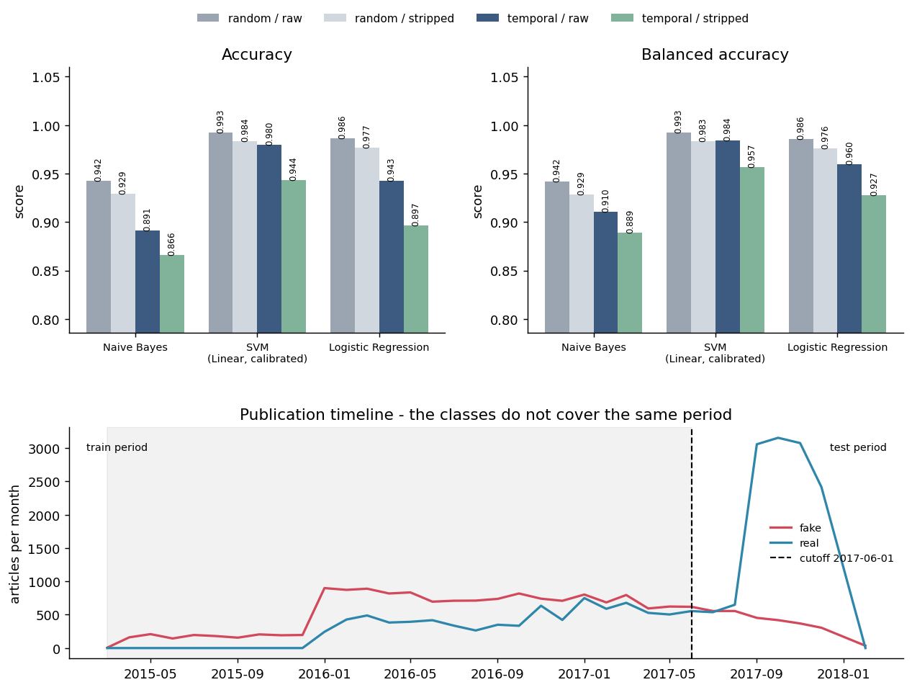

# Temporal Validation

Generated by `python src/temporal_eval.py --cutoff 2017-06-01`.
Raw numbers: `reports/temporal_results.csv`.

The shipped evaluation uses a random 80/20 split, which draws train and test rows
from the same weeks and the same news cycle. That measures interpolation. A
deployed detector sees articles published *after* everything it was trained on, so
this module retrains on a date cutoff instead: everything before 2017-06-01 is
training data, everything on or after it is the test set. The TF-IDF vocabulary and
IDF weights are fitted on the training period only - fitting them on the whole
corpus would carry future vocabulary backwards and quietly undo the split.

## 1. Date coverage

- **raw**: 39,103 de-duplicated articles loaded, 6 dates unparseable (**99.985% parsed**), 0 further rows cleaned to an empty string, leaving 39,097 usable.
- **stripped**: 39,100 de-duplicated articles loaded, 6 dates unparseable (**99.985% parsed**), 0 further rows cleaned to an empty string, leaving 39,094 usable.

`pd.to_datetime(..., errors="coerce", format="mixed")` handles ISOT's inconsistent
formats. The handful of failures are not dates at all - a few fake-side records carry
a source URL or a headline in the `date` column. They are dropped from both the
temporal split and the random-split control, so the two remain comparable.

## 2. The date is a third leakage channel

`src/eda.py` documents two ways this corpus gives the label away: the `(Reuters)`
tag (99%+ of real articles, ~0% of fake) and the `subject` field (7 of 7 categories
appear in only one class). The timestamps are a third.

| class | first | last | articles |
|---|---|---|---|
| fake | 2015-03-31 | 2018-02-19 | 17901 |
| real | 2016-01-13 | 2017-12-31 | 21196 |

The two classes were collected separately and do not cover the same calendar. The
overlap runs 2016-01-13 to 2017-12-31;
**2,028 articles (5.19% of the corpus) fall
outside it**, and 2,028 of those are fake against
0 real. In other words, publication date alone classifies
11.3% of all fake articles with no errors at all - if it was
published before 2016-01-13, it is fake, always.
11 of the 35 months in the corpus contain
exactly one class (1,680 articles).

What that is worth as a classifier:

| rule using the timestamp only | accuracy |
|---|---|
| majority class (always 'real') | 0.5421 |
| published before 2016-01-13 -> fake, else real | 0.5931 |
| best single date threshold (2017-08-22) | 0.7219 |

The single-threshold ceiling of **0.7219** is well short of the
**0.9937** that the Reuters rule scores on these same rows,
so the date is the weakest of the three channels. It is still
+0.180 over the majority-class
baseline, obtained from a single number that has nothing whatsoever to do with whether
the article is true.

There is a second-order consequence that matters more than the raw accuracy: because
`real` articles are concentrated in the later part of the corpus, *any* cutoff-based
split produces a test period that is mostly real and a training period that is mostly
fake. The prior shifts hard across the split, which is exactly the distribution shift
a deployed model would face, and it is invisible to a stratified random split.

## 3. The temporal experiment

Same estimators as `src/train.py` (`build_models()` is imported from it), same TF-IDF
settings (`max_features=5000`, `ngram_range=(1, 2)`,
`min_df=2`). `precision`/`recall`/`f1` are for the positive class
(`real` = 1); `recall_fake` is recall on the fake class, which is the one that
collapses first when the test period is skewed.

### Variant: raw text

Training period ends 2017-06-01: **14,589 fake / 7,748 real**
(22,337 articles, 5,000 TF-IDF features fitted on this period only).
Test period: **3,312 fake / 13,448 real** (16,760 articles,
80.2% real).

| model | accuracy | balanced_accuracy | precision | recall | f1 | recall_fake | roc_auc |
|---|---|---|---|---|---|---|---|
| Naive Bayes | 0.8914 | 0.9105 | 0.9840 | 0.8789 | 0.9285 | 0.9420 | 0.9743 |
| SVM (Linear, calibrated) | 0.9799 | 0.9842 | 0.9978 | 0.9771 | 0.9873 | 0.9912 | 0.9987 |
| Logistic Regression | 0.9425 | 0.9596 | 0.9968 | 0.9314 | 0.9630 | 0.9879 | 0.9963 |

Baselines on the same test rows:

| baseline (temporal test set) | accuracy |
|---|---|
| predict train-majority class | 0.1976 |
| predict test-majority class (oracle) | 0.8024 |
| one rule: mentions Reuters -> real | 0.9973 |

Difference against the matched random split (temporal minus random, negative = the
temporal split is harder):

| model | d_accuracy | d_balanced_accuracy | d_f1 |
|---|---|---|---|
| Naive Bayes | -0.0509 | -0.0313 | -0.0184 |
| SVM (Linear, calibrated) | -0.0127 | -0.0084 | -0.0058 |
| Logistic Regression | -0.0439 | -0.0262 | -0.0246 |
### Variant: stripped text

Training period ends 2017-06-01: **14,587 fake / 7,748 real**
(22,335 articles, 5,000 TF-IDF features fitted on this period only).
Test period: **3,312 fake / 13,447 real** (16,759 articles,
80.2% real).

| model | accuracy | balanced_accuracy | precision | recall | f1 | recall_fake | roc_auc |
|---|---|---|---|---|---|---|---|
| Naive Bayes | 0.8657 | 0.8889 | 0.9794 | 0.8506 | 0.9105 | 0.9272 | 0.9609 |
| SVM (Linear, calibrated) | 0.9436 | 0.9565 | 0.9942 | 0.9351 | 0.9637 | 0.9780 | 0.9935 |
| Logistic Regression | 0.8968 | 0.9274 | 0.9938 | 0.8768 | 0.9316 | 0.9780 | 0.9894 |

Baselines on the same test rows:

| baseline (temporal test set) | accuracy |
|---|---|
| predict train-majority class | 0.1976 |
| predict test-majority class (oracle) | 0.8024 |
| one rule: mentions Reuters -> real | 0.1976 |

Difference against the matched random split (temporal minus random, negative = the
temporal split is harder):

| model | d_accuracy | d_balanced_accuracy | d_f1 |
|---|---|---|---|
| Naive Bayes | -0.0633 | -0.0397 | -0.0240 |
| SVM (Linear, calibrated) | -0.0399 | -0.0267 | -0.0211 |
| Logistic Regression | -0.0802 | -0.0487 | -0.0473 |

## 4. Against the shipped random-split numbers

Shipped run: `src/train.py --cv 3`, 31,278 train / 7,820 test, boilerplate stripped: **False**. Reuters one-rule baseline recorded there: **0.9940**.

| model | accuracy | balanced_accuracy | f1 | roc_auc |
|---|---|---|---|---|
| Naive Bayes | 0.9422 | 0.9417 | 0.9467 | 0.9860 |
| SVM (Linear, calibrated) | 0.9932 | 0.9932 | 0.9937 | 0.9995 |
| Logistic Regression | 0.9867 | 0.9862 | 0.9878 | 0.9989 |

`balanced_accuracy` here is recomputed from the stored confusion matrix, so it is
comparable with the tables above.

## 5. Does the cutoff matter?

Not run. Add `--sweep` to re-run the experiment at 5 further cutoffs and check that the conclusion is not an artefact of where the line was drawn.

## 6. Reading this honestly

The headline result is a negative one: the temporal split barely hurts. SVM (Linear,
calibrated) still reaches 0.9799 accuracy and 0.9842 balanced accuracy on articles
published after the cutoff, and the one-line Reuters rule scores 0.9973 on the very same
test rows. That is the explanation, not a mystery: a temporal split neutralises the date
channel (every test article now sits in the real-only stretch of the calendar, so the
timestamp carries no information inside the test set) but it does nothing at all about
the publisher fingerprint, which travels with the articles into the future. Splitting by
time cannot fix a corpus whose two halves came from two different newsrooms.

So the value of this module is diagnostic rather than corrective. It rules out one
explanation for the ~99% headline number - it is not simply that near-duplicate articles
straddled the random split - and it leaves the publisher explanation standing. The
stripped variant above is the more informative half of the table: whatever accuracy
survives with the Reuters fingerprints removed AND a future test period is the closest
thing to an honest estimate this dataset can produce on its own.

Two caveats on the numbers themselves. First, the test period is heavily imbalanced, so
read balanced accuracy and recall_fake rather than accuracy; `--balance-test` re-scores
the same predictions on an equal-count subsample if you want the like-for-like view.
Second, the temporal split also shifts the class prior between train and test, so a
model that has simply learned the training prior is penalised for reasons unrelated to
text quality - part of any drop you see is prior shift, not lost signal.

The remaining check this cannot do is out-of-distribution evaluation. Even a future test
period is still ISOT: same two sources, same scrape, same formatting. `python
src/cross_dataset_eval.py` against an independently collected corpus is the only test
that breaks the publisher confound.
