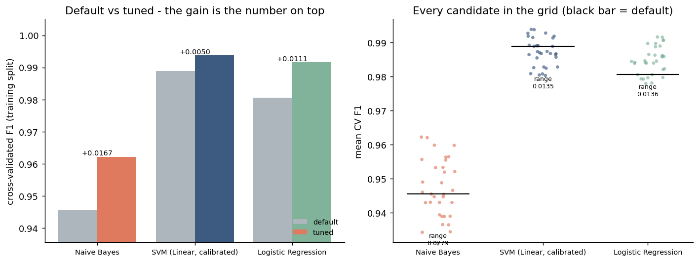
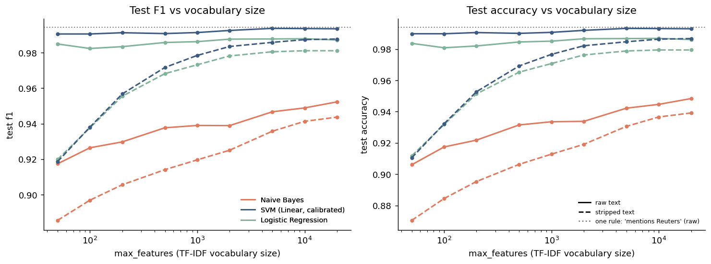

# Hyperparameter Tuning and Feature Ablation

Generated by `python src/tune.py`. Raw tables: `reports/tuning_cv_results.csv`,
`reports/feature_ablation.csv`, `reports/first_features.csv`. Best parameters
in machine-readable form: `reports/best_params.json`.

Dataset: 31,278 training articles / 7,820 test articles
(`test_size=0.2`, `random_state=42`, duplicates dropped).

## Protocol

- Every parameter choice below was made by cross-validating on the **training
  split only** (3-fold stratified, `scoring='f1'`). The test split was
  scored exactly once, at the end, to report the outcome - never to pick it.
- The search ran on a stratified subsample of 12,000 training documents (38% of the split). Searching the whole split costs roughly four times as much wall-clock for differences that, as the results below show, sit inside the noise. `--search-sample 0` uses all of it.
- Grid level: `default`. Search: GridSearchCV(32 points).
- `svm` is searched as a bare `LinearSVC`; the shipped model wraps it in
  `CalibratedClassifierCV`, which changes the probability estimates but is
  tuned over the same `C`. Its numbers here are therefore close to, but not
  identical to, `models/metrics.json`.
- Text variant used for the search: **raw**.
  Stripping empties 0 article(s) entirely.

## 1. Search results

| model | default_cv_f1 | tuned_cv_f1 | cv_delta | cv_std_at_best | best_params |
|---|---|---|---|---|---|
| Naive Bayes | 0.9455 | 0.9622 | 0.0167 | 0.0024 | alpha=0.1, max_features=20000, min_df=2, ngram_range=(1, 2), sublinear_tf=True |
| SVM (Linear, calibrated) | 0.9888 | 0.9938 | 0.0050 | 0.0005 | C=1.0, max_features=5000, min_df=5, ngram_range=(1, 2), sublinear_tf=True |
| Logistic Regression | 0.9805 | 0.9916 | 0.0111 | 0.0003 | C=10.0, max_features=5000, min_df=2, ngram_range=(1, 2), sublinear_tf=True |

### Which knob actually moved the score

Marginal means: for each parameter value, the average CV F1 over every
candidate that used it. `spread` is the gap between the best and worst value -
a parameter with a spread near zero is one this dataset does not care about.

| model | parameter | best_value | best_f1 | worst_value | worst_f1 | spread |
|---|---|---|---|---|---|---|
| Naive Bayes | ngram_range | (1, 2) | 0.9542 | (1, 1) | 0.9408 | 0.0134 |
| Naive Bayes | sublinear_tf | True | 0.9510 | False | 0.9440 | 0.0070 |
| Naive Bayes | max_features | 20000 | 0.9500 | 5000 | 0.9450 | 0.0049 |
| Naive Bayes | alpha | 0.1 | 0.9485 | 1.0 | 0.9465 | 0.0021 |
| Naive Bayes | min_df | 2 | 0.9476 | 5 | 0.9474 | 0.0001 |
| SVM (Linear, calibrated) | C | 1.0 | 0.9901 | 0.1 | 0.9844 | 0.0057 |
| SVM (Linear, calibrated) | sublinear_tf | True | 0.9898 | False | 0.9847 | 0.0051 |
| SVM (Linear, calibrated) | ngram_range | (1, 2) | 0.9882 | (1, 1) | 0.9862 | 0.0020 |
| SVM (Linear, calibrated) | max_features | 5000 | 0.9875 | 20000 | 0.9869 | 0.0006 |
| SVM (Linear, calibrated) | min_df | 5 | 0.9873 | 2 | 0.9872 | 0.0001 |
| Logistic Regression | C | 10.0 | 0.9877 | 1.0 | 0.9817 | 0.0060 |
| Logistic Regression | sublinear_tf | True | 0.9871 | False | 0.9823 | 0.0048 |
| Logistic Regression | ngram_range | (1, 2) | 0.9856 | (1, 1) | 0.9838 | 0.0017 |
| Logistic Regression | max_features | 5000 | 0.9852 | 20000 | 0.9842 | 0.0011 |
| Logistic Regression | min_df | 5 | 0.9847 | 2 | 0.9847 | 0.0000 |

## 2. Was tuning worth it?

The honest test is not "did the number go up" but "did it go up by more than
the test split's own sampling noise". The interval below is a paired bootstrap
(2,000 resamples) of the *difference* in test F1 between the default
and tuned configurations, refit on the full training split.

- **Naive Bayes**: CV F1 0.9455 -> 0.9622 (+0.0167); test F1 0.9467 -> 0.9613 (+0.0146, 95% CI [+0.0114, +0.0179], bootstrap SD of a single test F1 = 0.0025). a real but small change - the CI excludes zero.
- **SVM (Linear, calibrated)**: CV F1 0.9888 -> 0.9938 (+0.0050); test F1 0.9943 -> 0.9960 (+0.0016, 95% CI [+0.0006, +0.0027], bootstrap SD of a single test F1 = 0.0008). a real but small change - the CI excludes zero.
- **Logistic Regression**: CV F1 0.9805 -> 0.9916 (+0.0111); test F1 0.9878 -> 0.9939 (+0.0061, 95% CI [+0.0044, +0.0079], bootstrap SD of a single test F1 = 0.0012). a real but small change - the CI excludes zero.

A confidence interval that contains zero means the tuned configuration and the
default one are indistinguishable on this data, and the tuning was not worth
doing. Where an interval excludes zero, check the size of the effect before
celebrating: a change of a few thousandths of F1 on a task a keyword rule
already solves is not a modelling improvement in any sense that matters.

## 3. Feature-count ablation

Test F1 at each vocabulary size, holding `ngram_range=(1, 2)` and
`min_df=2` fixed so only `max_features` varies. Columns are
`variant/model`.

| max_features | raw/lr | raw/nb | raw/svm | stripped/lr | stripped/nb | stripped/svm |
|---|---|---|---|---|---|---|
| 50 | 0.9849 | 0.9174 | 0.9906 | 0.9199 | 0.8855 | 0.9186 |
| 100 | 0.9824 | 0.9264 | 0.9906 | 0.9377 | 0.8969 | 0.9381 |
| 200 | 0.9834 | 0.9298 | 0.9913 | 0.9555 | 0.9056 | 0.9568 |
| 500 | 0.9858 | 0.9377 | 0.9908 | 0.9682 | 0.9141 | 0.9717 |
| 1000 | 0.9863 | 0.9390 | 0.9914 | 0.9732 | 0.9196 | 0.9785 |
| 2000 | 0.9877 | 0.9389 | 0.9926 | 0.9782 | 0.9250 | 0.9835 |
| 5000 | 0.9878 | 0.9467 | 0.9937 | 0.9806 | 0.9358 | 0.9859 |
| 10000 | 0.9879 | 0.9489 | 0.9936 | 0.9811 | 0.9413 | 0.9874 |
| 20000 | 0.9872 | 0.9523 | 0.9935 | 0.9811 | 0.9437 | 0.9878 |

For reference, one rule ("mentions Reuters") scores accuracy 0.9940 / F1 0.9945 on the same test articles.

Accuracy at the same points (the table above is F1; both are in
`reports/feature_ablation.csv` and both panels are in the figure). Numbers are
the best of the three models at that vocabulary size.

With the **raw** text, 50 features reach **0.9898 accuracy**
and 20000 features reach 0.9930. Two hundred features reach 0.9905. Across every
vocabulary size from 100
upwards the accuracy moves by 0.0035 in total.

A model that needs 50 words to hit 99.0% is not answering
"is this article true". It is answering "which of two publishers wrote this",
and a handful of high-frequency tokens is enough for that. This is the same
conclusion `reports/eda_report.md` reaches from the other direction, and it is
why `max_features` is not a meaningful thing to tune on this corpus: every
value in the grid sits far past the point where the leak is exhausted, so the
search can only pick between configurations that have all already saturated.

With boilerplate **stripped**, the same 50-term vocabulary gives 0.9118 and 20000 terms give 0.9867. The gap between the two curves is the part of the score the publisher fingerprint was carrying.

## 4. What the first features actually are

The 30 terms a TF-IDF vocabulary selects first, with the share
of each class that contains them. `gap` near 1.0 means the term alone
separates the classes.

| rank | term | corpus_tf | in_fake | in_real | gap |
|---|---|---|---|---|---|
| 1 | trump | 109157 | 0.589 | 0.451 | 0.138 |
| 2 | said | 98161 | 0.556 | 0.938 | 0.382 |
| 3 | president | 40129 | 0.452 | 0.608 | 0.156 |
| 4 | people | 29511 | 0.511 | 0.365 | 0.146 |
| 5 | state | 25005 | 0.237 | 0.399 | 0.163 |
| 6 | reuters | 23238 | 0.012 | 0.998 | 0.986 |
| 7 | new | 22845 | 0.330 | 0.390 | 0.061 |
| 8 | house | 21558 | 0.253 | 0.328 | 0.076 |
| 9 | donald | 21265 | 0.438 | 0.436 | 0.002 |
| 10 | republican | 20258 | 0.250 | 0.304 | 0.054 |
| 11 | obama | 20134 | 0.263 | 0.179 | 0.083 |
| 12 | government | 20103 | 0.175 | 0.389 | 0.214 |
| 13 | donald trump | 19985 | 0.432 | 0.431 | 0.001 |
| 14 | clinton | 19787 | 0.225 | 0.108 | 0.117 |
| 15 | states | 19369 | 0.240 | 0.358 | 0.119 |
| 16 | just | 18082 | 0.543 | 0.165 | 0.378 |
| 17 | year | 17684 | 0.240 | 0.386 | 0.146 |
| 18 | white | 17187 | 0.269 | 0.227 | 0.042 |
| 19 | united | 16889 | 0.195 | 0.342 | 0.147 |
| 20 | told | 16584 | 0.248 | 0.429 | 0.181 |
| 21 | campaign | 16202 | 0.237 | 0.231 | 0.006 |
| 22 | election | 15991 | 0.196 | 0.267 | 0.070 |
| 23 | party | 15445 | 0.172 | 0.231 | 0.059 |
| 24 | like | 15431 | 0.456 | 0.161 | 0.295 |
| 25 | time | 14651 | 0.378 | 0.253 | 0.125 |
| 26 | news | 13530 | 0.292 | 0.200 | 0.092 |
| 27 | washington | 13529 | 0.130 | 0.422 | 0.292 |
| 28 | united states | 13502 | 0.177 | 0.282 | 0.104 |
| 29 | country | 12774 | 0.246 | 0.270 | 0.024 |
| 30 | did | 11973 | 0.280 | 0.249 | 0.030 |

`reuters` first enters the vocabulary at **rank 6** of
20,000 probed terms, as `reuters`. The first six Reuters-bearing
terms are `reuters` (rank 6), `washington reuters` (rank 137), `told reuters` (rank 427), `reuters president` (rank 705), `york reuters` (rank 2056), `reuters republican` (rank 2112).

This ranking is unsupervised - `max_features=k` keeps the k most frequent
terms and never looks at the label - so the ordering is not a model choosing
a good feature. It is simply that the word appears in essentially every real
article and essentially no fake one, which makes it frequent *and* perfectly
discriminative at the same time. Any vocabulary large enough to include rank
6 gets the leak for free.

## 5. Reading this honestly

1. **Tuning is not where the problem is.** Best and worst candidate in the grid differ by at most 0.0279 F1 (worst candidate anywhere: 0.9343). Reporting "we tuned the model and reached 0.9938" would be true and uninformative - the score was already there before tuning, and a keyword rule reaches it too.
2. **`max_features=5000` was never load-bearing.** In the ablation,
   50 features already reach 99.0% accuracy and the curve moves by only 0.0035 above that. The defensible claim about the current value is
   "comfortably past saturation", not "optimal", and that is the claim this
   project should make.
3. **The interesting axis is the text, not the hyperparameters.** The gap
   between the raw and stripped ablation curves is larger than anything the
   grid produced. That is where the modelling effort belongs.
4. **What tuning is still good for.** It rules out the possibility that the
   defaults were badly wrong, and it turns three magic numbers into three
   measured ones. That is a real if unglamorous result, and it is the only
   claim these numbers support.

## Feeding this back into training

`reports/best_params.json` stores the winning parameters. `train.py` currently
exposes `--max-features`, `--ngram-max` and `--min-df`; `sublinear_tf` and the
classifier's own parameter (`alpha` / `C`) are not CLI flags yet, so applying
the full configuration would need a small change there. Given section 2, doing
so would not measurably change the results.
